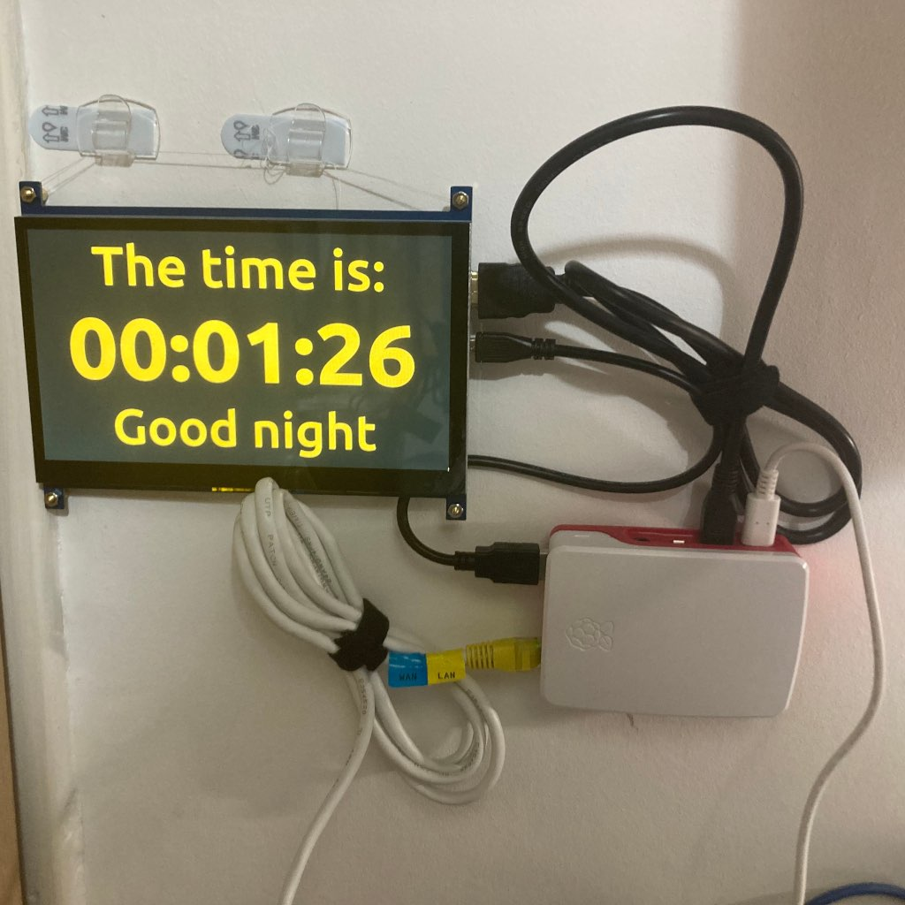

# overpriced-clock

As the name suggests, Overpriced Clock is just that.  

In the spring of 2021, I bought a Raspberry Pi for an (unsuccessful) attempt at mining cryptocurrency on a low-powered machine using a hard drive dock and a [Proof-of-Space algorithm](https://en.wikipedia.org/wiki/Proof_of_space).  The concept was solid, but the currency grew fast and within a few months it was no-longer financially viable to mine on the Raspberry Pi.  Following the dramatic failure of that, I decided to repurpose my Pi by adding a screen and turning it into a rather overpriced wall clock.

## Tech specs

This requires Python 3 and the [PySimpleGUI](https://pysimplegui.readthedocs.io/en/latest/readme/) library to run.

Simply run the clock.py script, and the clock should pop open in a window.  If you're using a 1024x600 screen, it will fill the screen.

## My Setup

- Raspberry Pi 4B, running Raspberry Pi OS, 64-bit.
- [Starter kit from The Pi Hut: case, Micro SD card, Power adapter, etc](https://thepihut.com/products/raspberry-pi-starter-kit?variant=20336446079038).
- [SunFounder 7" 1024x600 LCD Touchscreen display](https://www.sunfounder.com/collections/raspberry-pi-store/products/7inch-ips-touchscreen).
- Command hooks and thread to mount the screen, and a Command picture-hanging strip for the Pi.

_Above: an image of the clock in action._

## Like what you see?  Buy me a snack

If you want to see more of what I do, you can visit [my blog](https://jamesphillipsuk.com "Go there now").

If you want to donate to my development work by buying me a snack, I use [PayPal.Me](https://paypal.me/JamesPhillipsUK "My PayPal.Me").
